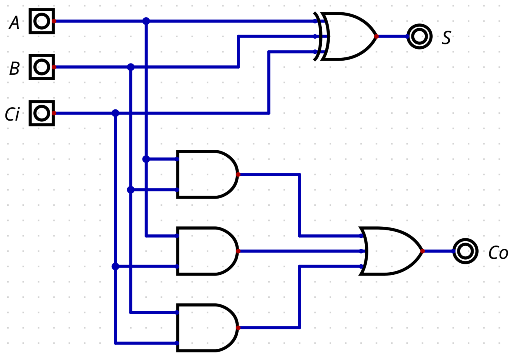
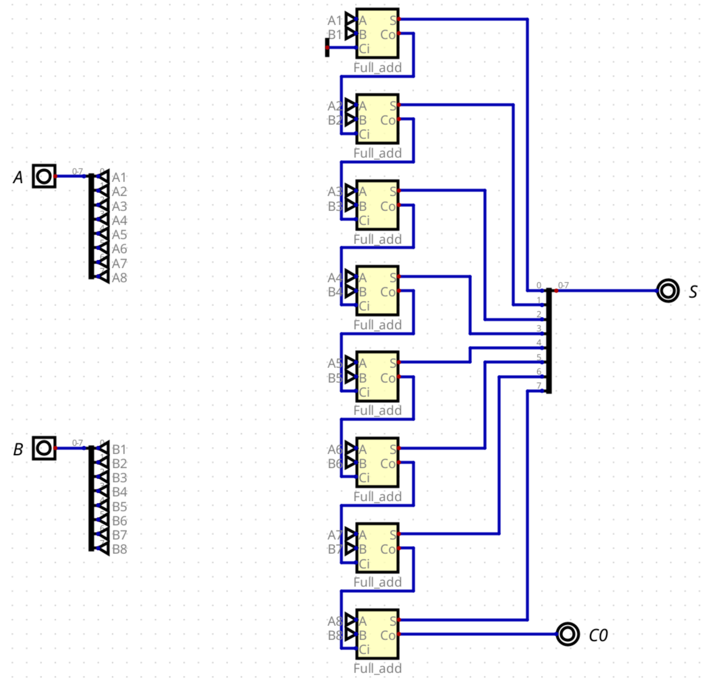

# Introdução

Esse projeto é uma simulação de uma CPU de 8 bits construida no software Digital. Para ver a demonstração da solução, [Clique aqui](https://youtu.be/KuO-FU2rZVo)

IMPORTANTE!! A ROM do MAR da CPU apresenta somente uma unica estrutura de informação. A variável que está sendo pega é a mesma da ordem de instrução. Foi tentado separar os MAR em um mar para instrução e um para variável, porém a execução bugava no meio, então fora mantido do jeito que está no vídeo.

# Detalhamento do projeto

O projeto foi feito com a arquitetura SAP (Simple as Possible) em mente. Foi Construida uma ALU (unidade aritimética), PC (Problem counter), Dois acumuladores, W-bus, IR (Instruction Register), MAR (Memory Address Register), RC (Ring Counter) e o CC (Control Circuit).

## ALU

A ALU foi construida para ter 4 operações básicas: Soma, Subtração, Multiplicação e Divisão. Ao contrário da arquiterura SAP, apresenta duas operações a mais, o que vai gerar mudançãs na palavra de controle do circuito de controle. 

A pesar da operação de incremento e decremento também serem muito importantes para a CPU, foi desconsiderada, pois caso necessário será feita uma operação de soma/subtração com A sendo o Imput e B sendo 1. Essa decisão foi tomada a fim da ALU conseguir funcionar com apenas 2 bits de escolha, ou seja, quando escolher a operação, como há 4 operações, 2 bits é o suficiente.

### Soma

Primeiro precisamos de um somador de um bit. Com um somador de bit, precisamos considerar também o carry. Então o sistema fica como a figura abaixo:

Então, para transformar isso em uma operação de 8 bits, dividimos dois imputs em cada bit e somamos eles com a soma de 1 bit, usando o carry in da soma como o carry out da soma anterior.

### Subtração

## PC

## Acumuladores

## W-BUS

## IR

# MAR

# Ring Counter

# Control Circuit